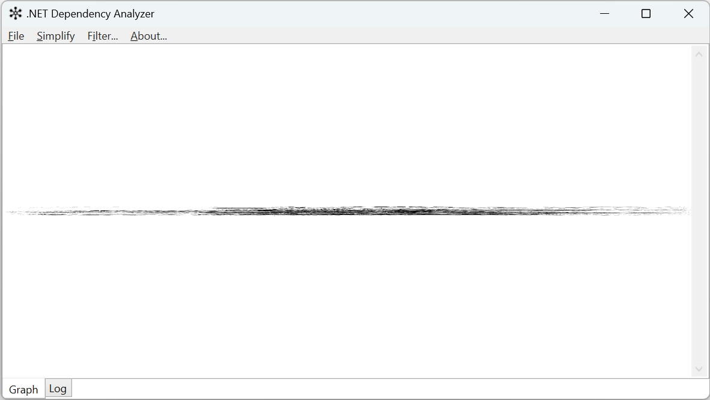

After manually drawing an assembly dependency graph for a twenty-something-project solution in 2003, this software was born.

## How it works

Run the application, and open a .NET assembly, project or solution from the _File|Open..._ menu (or just press <kbd>Ctrl</kbd>+<kbd>O</kbd>).

Let's see how it looks if we run the application on itself:

As you can see there is a lot of information here and the graph is impossible to read as-is.
It's possible to zoom and pan, and you can drag nodes around to make things easier to see,
but most of the time you'll want to hide assemblies you're not interested in.

Using the _Filter..._ command lets us exclude items we don't want to see. Removing several
`System.*`and other framework assemblies gives a clearer picture:

You can open either assemblies or MSBuild project/solution files. The latter produces richer data,
including target frameworks which can be useful for multi-targeting projects.

## Installation

1. Download zipped binaries on the [releases page](https://github.com/drewnoakes/dependency-analyser/releases) and extract to a folder on your PC.
2. Run `DependencyAnalyser.exe` to start the program.